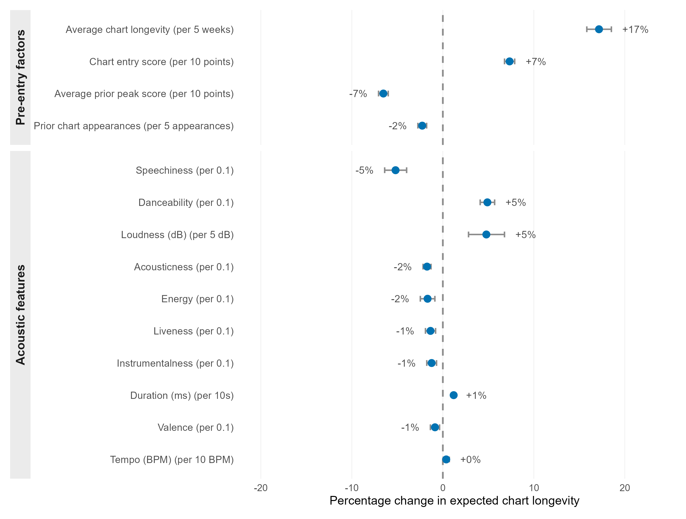
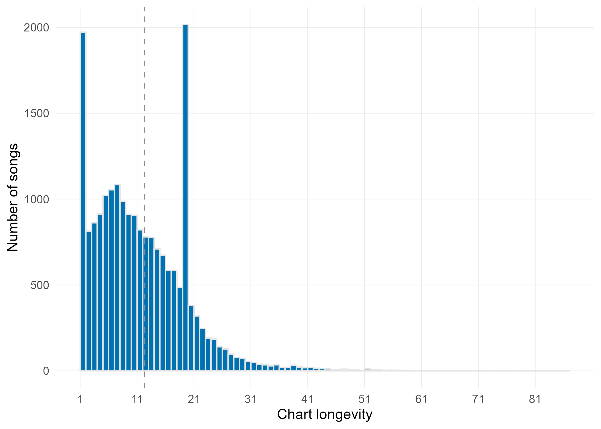
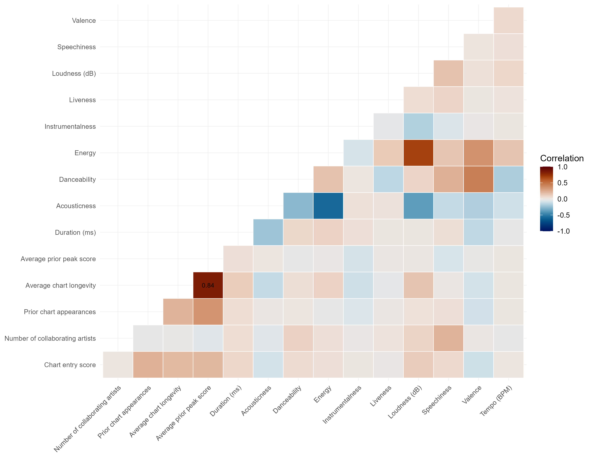
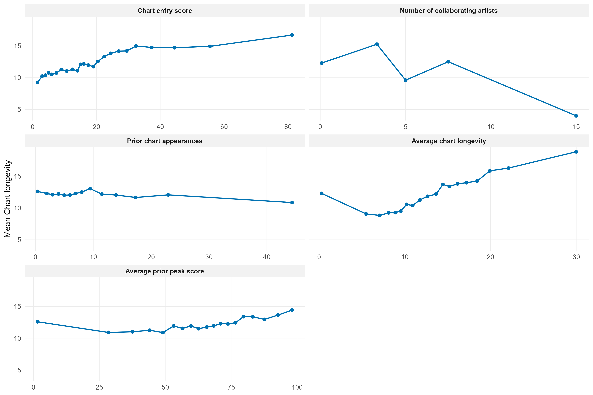

# Modelling Song Chart Longevity

## Summary

Most Hit Song Science research asks whether a song charted at all. This analysis asks how long it stayed there, modelling weeks on chart across 20,303 Billboard songs from 1962 to 2018. Because chart runs are counts with a long right tail, a Negative Binomial model was used. Artist track record dominates: prior average chart longevity is the strongest predictor by a wide margin, while acoustic features are statistically significant but small once artist history is accounted for. Stronger prior peak performance is associated with *shorter* subsequent runs, which is consistent with peaks reflecting front-loaded attention rather than durable appeal.

## Why longevity

A yes/no measure puts a song that charted for a week and a song that charted for a year in the same category, losing the thing most worth explaining. Popularity also looks like a process rather than an event: early attention creates visibility, which creates more attention. A duration measure fits that; a single yes/no doesn't. Despite this, chart longevity is rarely modelled directly.

Two questions drove the analysis:

- How much of sustained chart presence is explained by an artist's history and prior exposure?
- Once that's accounted for, what's left for the song itself to explain?

## Data

MusicOSet joins Billboard chart performance to song metadata and Spotify acoustic features. Raw files are shared with the clustering analysis and held at `data/raw/` in the repository root.

Only tables with a week variable were kept, so everything could be aligned to the point of chart entry and nothing from later in a song's run could leak backwards into its predictors. That gave acoustic features and metadata for 20,405 songs, plus 250,392 weekly chart observations.

Weekly rows were aggregated to one row per song. Songs already mid-run when the data begins were dropped, because their chart runs and entry positions are cut off and would be measured wrongly. That removed 98 songs. One song with invalid audio values was dropped. The final sample is **20,303 songs** across 5,992 artists, 3,088 of whom appear only once.

Artist history was built using only songs that charted *before* the song in question, so nothing about a song's own performance can end up on the right-hand side of its own model. Where a song had several credited artists, their histories were averaged.

## Method

Chart runs average 12.3 weeks but vary far more than that (variance 67.6). A Poisson model assumes those two numbers are roughly equal, and a formal test confirmed they aren't (dispersion statistic 51.34). Negative Binomial regression handles that extra spread, and fits far better than Poisson (AIC 135,461 against 176,914).

Only 5.3% of songs lasted a single week, so there was no need for a model that treats zeros specially. Continuous predictors were standardised so their effects are comparable.

Adding key, mode and time signature barely moved the fit (AIC 135,436) and changed nothing substantive, so the simpler model was kept.

## Results

| Predictor | Effect (IRR) | 95% CI |
|---|---|---|
| **Artist history and entry** | | |
| Average prior chart longevity | 1.29 | 1.27 – 1.31 |
| Chart entry score (higher = better rank) | 1.14 | 1.13 – 1.15 |
| Average prior peak score (higher = better rank) | 0.80 | 0.79 – 0.82 |
| Prior chart appearances | 0.96 | 0.95 – 0.97 |
| Collaborating artists | 1.01 | 0.99 – 1.04 (n.s.) |
| **Acoustic features** | | |
| Duration | 1.08 | 1.07 – 1.09 |
| Danceability | 1.07 | 1.06 – 1.09 |
| Loudness | 1.03 | 1.02 – 1.05 |
| Tempo | 1.01 | 1.00 – 1.02 |
| Energy | 0.97 | 0.95 – 0.98 |
| Speechiness | 0.96 | 0.95 – 0.97 |
| Acousticness | 0.95 | 0.94 – 0.97 |
| Instrumentalness | 0.98 | 0.97 – 0.99 |
| Liveness | 0.98 | 0.97 – 0.99 |
| Valence | 0.98 | 0.97 – 0.99 |

Values above 1 mean longer chart runs, below 1 shorter, per one standard deviation increase in the standardised predictor. The figure below rescales these into interpretable units instead. Full model output is written to `outputs/models/model_summary.txt`.

Rescaled into units that mean something, the gap between the two blocks is the whole story:



*Note: MusicOSet uses an inverted chart-rank score, so higher values indicate better chart performance.*

Two associations cut against intuition. Prior chart appearances show a small negative association with longevity, and stronger prior *peak* performance is also associated with shorter subsequent runs. Both may be consistent with peak-oriented or repeated success reflecting more front-loaded attention rather than durable appeal.

Acoustic features still matter, just not much. Louder and more danceable songs last slightly longer; speech-heavy, acoustic, live and instrumental songs last slightly less, which tracks mainstream production norms rather than anything about the music itself.

### Checks

Prior longevity and prior peak rank are related (VIF 4.09 and 4.29), which makes sense as both describe past success, but not enough to destabilise the model, and both were kept as distinct ideas. No individual song drives the results (max Cook's distance 0.009). Simulated residual checks showed no pattern in the residual or QQ plots, though at this sample size the formal calibration tests trip easily and shouldn't be over-read.

## Why the figures look like this

**Outcome distribution.** A histogram rather than a density curve, because the outcome is a count and the argument for using Negative Binomial rests on seeing how far the spread runs past the mean. Smoothing it would hide the thing the figure exists to show.



**Correlation heatmap.** The palette is colour-blind safe and perceptually even, so zero reads as neutral rather than as a step change in colour. Only correlations above 0.70 are labelled: the point is to spot variables that overlap too much, not to read off every value, and labelling all of them adds clutter without adding information.



**Binned averages.** Each predictor is cut into equal-sized bins and averaged, rather than fitted with a smooth curve. A curve would impose a shape; bins let the shape show itself, which is the point when you're deciding whether a straight-line assumption is reasonable. Wobbles at the edges are thin data, not structure.



**Effects plot.** Model coefficients are converted from standard deviations into real units: per 5 weeks, per 10 chart positions, per 0.1 of a feature. Effects per standard deviation are hard to picture and quietly invite comparisons between things measured on completely different scales. Splitting artist factors from acoustic features is deliberate, because the contrast between the two blocks *is* the finding. Ranking all fifteen in one list would bury it.

## Limitations

This is observational. It describes associations rather than establishing cause. Artist history is built only from earlier chart data, which stops the obvious circularity, but the things that plausibly drive both artist history and longevity, like label backing, promotional spend and playlist placement, aren't in this data at all.

Acoustic features are treated here as independent predictors. The [clustering analysis](../02-acoustic-structures) argues that this is itself part of why they look so weak and unstable across the literature.

## Running it

| | |
|---|---|
| Language | R 4.x |
| Packages | tidyverse, MASS, AER, performance, DHARMa, broom, scico |
| Entry point | `R/00_run_all.R` |
| Input | `data/raw/` (MusicOSet, shared with the clustering analysis) |
| Output | `clean/song_df.csv`, `outputs/figures/`, `outputs/models/`, `outputs/descriptives/` |
| Runtime | about a minute |

Open `hit-song-science.Rproj` at the repository root in RStudio, then:

```r
source(here::here("01-chart-longevity", "R", "00_run_all.R"))
```

Paths resolve from the project root, so no working directory needs setting. `source("run_all.R")` from the root runs this analysis and the clustering analysis together.

| Script | Does |
|---|---|
| `R/01_data_cleaning.R` | Joins the raw tables, builds artist history, writes `clean/song_df.csv` |
| `R/02_eda.R` | Distribution, correlation and functional form checks |
| `R/03_fit_nb_models.R` | Poisson baseline, dispersion test, Negative Binomial fits |
| `R/04_report_nb_outputs.R` | Effect tables, diagnostics, figures |
| `R/analysis_setup.R` | Variable sets, labels, encoding, scaling |
| `R/helpers.R` | Shared utilities and plot theme |
| `R/paths.R` | Resolves this analysis's paths from the repository root |
