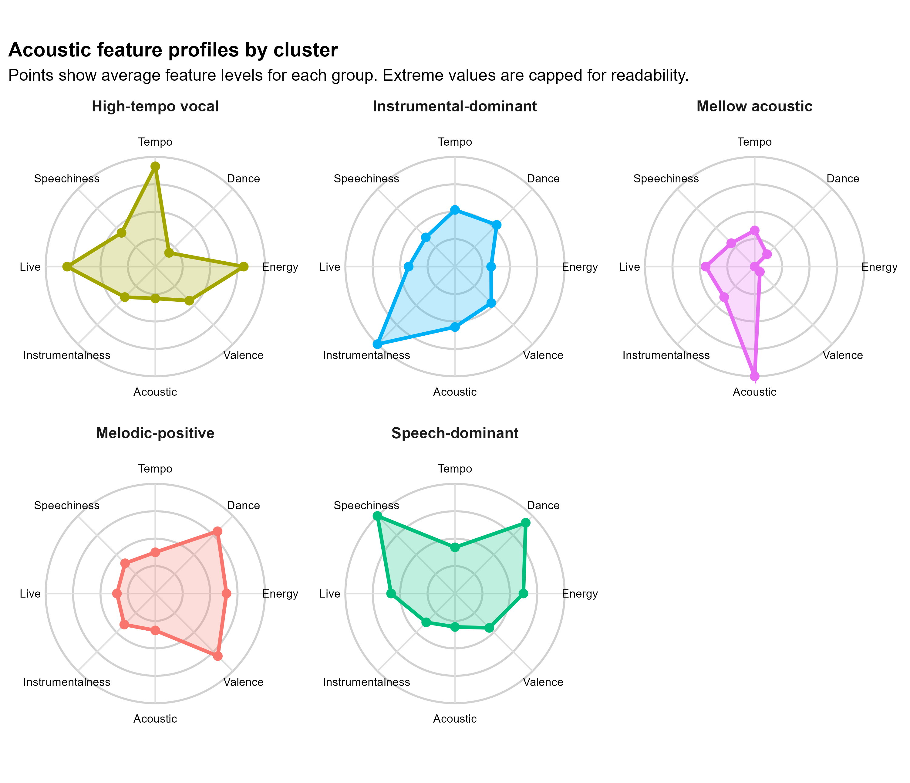
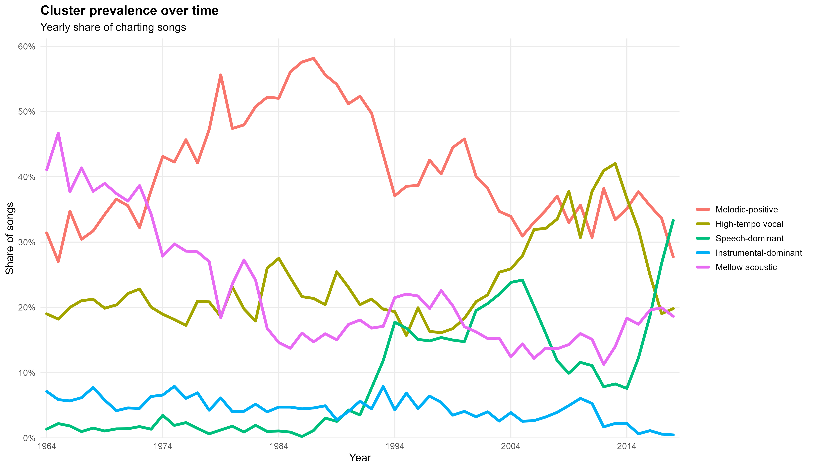
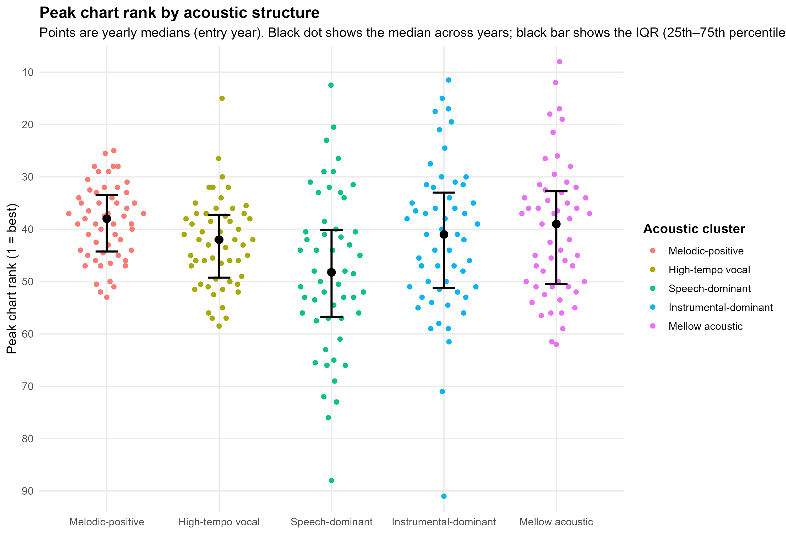
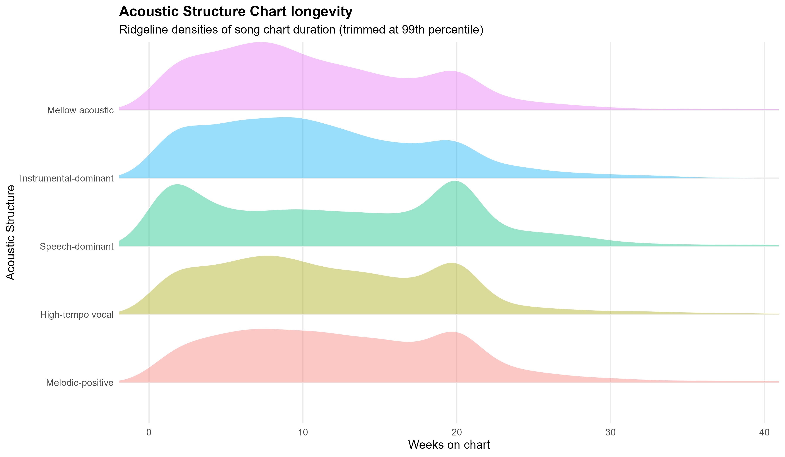

# Acoustic Structures, Not Features

## Summary

Acoustic features have a weak and unreliable relationship with chart success, and studies disagree about which ones matter. This analysis tests whether that's because features are being used wrongly. Rather than treating tempo, energy and danceability as separate predictors, it standardises them, reduces them with PCA, and clusters songs in that reduced space. Five interpretable acoustic profiles emerge, and their share of the charts shifts substantially across decades. Which profile a song belongs to is more informative about how long it lasts than about how high it peaks. Studies pooling several decades may therefore average across historically different acoustic compositions, providing one plausible explanation for unstable feature-level estimates across datasets and periods.

## The idea being tested

Acoustic features are normally entered into models as independent predictors. But tempo isn't independent of energy, and neither is independent of genre. There's a long-standing suspicion that these features act as a rough proxy for genre and production style rather than measuring anything intrinsic to the music.

If that's right, the independence assumption is the problem. Features would combine into a handful of recognisable acoustic profiles, and if those profiles rise and fall over time, a study covering several decades is averaging over groups that don't resemble each other. Unstable coefficients become the expected outcome rather than a puzzle.

The analysis asks three things: do coherent acoustic profiles emerge, do they change over time, and does it matter whether success is measured as peak position or staying power?

## Data

MusicOSet, shared with the longevity model and held at `data/raw/` in the repository root. Songs already mid-run when the data begins were dropped so chart runs aren't cut off, and records with missing values or invalid tempo were removed.

## Method

Eight acoustic features were standardised, then reduced with PCA, which strips out the overlap between correlated features and leaves a smaller set of independent dimensions. The first five components were kept, and songs were clustered in that reduced space. PCA does not itself produce the groupings; it only provides the space the clustering runs in.

The number of clusters was chosen using elbow and silhouette diagnostics across k values from 2 to 10, with silhouette computed on a 4,000-song sample because the full distance matrix is quadratic and doesn't finish. Five clusters were retained.

The clustering was rerun with loudness added and with tempo removed, to check the structure wasn't an artefact of one feature.

Cluster names are worked out at runtime from each cluster's own feature profile, by matching each cluster to the profile whose signature feature it scores highest on. k-means numbers its clusters arbitrarily and the numbering can change between runs, so hard-coding "cluster 1 is the acoustic one" would silently mislabel everything the first time someone else ran it.

## Results

Five clear, interpretable acoustic profiles emerge, each defined by one or two features standing well clear of the rest.

| Profile | What defines it (standard deviations from average) |
|---|---|
| Instrumental-dominant | instrumentalness +4.2 |
| Speech-dominant | speechiness +2.9, danceability +0.8 |
| Mellow acoustic | acousticness +1.1, energy −1.1, valence −0.9 |
| High-tempo vocal | tempo +0.8, liveness +0.6, energy +0.6 |
| Melodic-positive | valence +0.6, danceability +0.6 |



That these come out so cleanly interpretable is consistent with the idea that engineered acoustic features may partly proxy broader genre and production conventions rather than isolated musical properties. They are descriptive acoustic structures, not validated genre labels.

**The profiles shift over time.** Their share of the charts changes substantially across decades. Melodic, upbeat songs dominate from the 1970s through the 1990s and then decline. Speech-heavy songs barely register before 1990 and become one of the largest groups by 2018.



This provides one plausible mechanism for inconsistent feature effects across studies. A study pooling several decades may average across historically different acoustic compositions, so its coefficients describe no particular period well.

**Structure relates to persistence more than peak.** Median peak positions differ only slightly between profiles and overlap heavily, so no profile is reliably associated with higher-charting songs.



Chart longevity distributions separate them more clearly, with visible differences in shape and in how long the tails run.



Acoustic structure appears more strongly associated with how long a song remains on the chart than with how high it peaks, which is consistent with the [longevity model's](../01-chart-longevity) finding that peak position is the noisier measure of the two.

## Why the figures look like this

Each figure was designed around the question it answers rather than picked as a chart type, and the alternatives below were actually built before being rejected.

**Acoustic profiles (radar).** Each spoke is a feature and distance from the centre is the score, with the same orientation and scale on every panel so shapes can be compared directly. Values are capped at ±1 standard deviation, which keeps typical profiles readable at the cost of understating the extremes, and the cap is stated on the figure rather than hidden. Radar charts are bad for reading exact values, but the question here is which shape belongs to which profile, and they do that well.

**Prevalence over time (line chart).** Plotted as a share of each year's charting songs rather than as counts, so it isn't distorted by how many songs charted that year. All five on one axis makes crossovers and turning points visible.

A **Sankey diagram** was built and rejected. Flows imply songs moving between profiles, but a song's profile is fixed; only the mix changes. It would also need decade-sized bins to stay readable, hiding the year-to-year movement that is the entire point.

A **waffle chart** was built and rejected too. It shows composition at one moment intuitively, but doesn't scale to sixty years without either repetition or animation, and grids make rates of change hard to see.

**Peak position (beeswarm).** The finding is overlap, so the figure shows every song with medians marked rather than five summary bars. It's deliberately the least dramatic figure here: drawing weak, overlapping differences as clean separation would misrepresent the result.

**Chart longevity (ridgeline).** **Boxplots** were rejected because reading them requires knowing what quartiles are, and they hide the shape of the distribution, which is exactly what differs between profiles. **ECDFs** were rejected because comparing curves by slope is harder work than comparing shapes. Ridgelines put spread, skew and multiple peaks straight in front of the reader. They're stacked on a shared axis rather than overlaid, and labelled directly instead of via a legend, so nobody has to hold a colour key in their head. The tail is trimmed at the 99th percentile so a handful of extreme songs don't squash everything else flat.

## How to read these figures carefully

Grouped averages get read as causal even when no causal claim is made. The clusters are built purely from audio similarity, so any apparent performance difference can slide into a story where the music alone explains success, quietly writing out promotion, label backing and the advantage of already being known.

People also look at the middle of each group and ignore the overlap between them. In the peak figure the overlap *is* the result, but a prominent median marker still pulls the eye.

The profiles are told apart mainly by colour, which is a problem for colour-blind readers and in greyscale. Direct labelling helps but isn't a full fix; varying line style or contrast would be a real improvement. The ridgelines also assume familiarity with density plots and can be misread as counts.

## Limitations

This describes, it doesn't explain causally. A profile being associated with longer chart runs is not evidence that the music caused it. Label affiliation, promotional spend and playlist placement aren't in this data and are plausibly more important than anything measured here.

Peak and longevity are compared using yearly medians, which flattens variation inside each profile and hides rare but important cases like breakout hits. The number of songs behind each point isn't shown, so groups with thin data can look as well-evidenced as groups with plenty.

Everything is static, so a reader can't check how the picture changes under a different summary or a different cut of the data.

## Running it

| | |
|---|---|
| Language | R 4.x |
| Packages | tidyverse, cluster, ggridges, ggbeeswarm, scales |
| Entry point | `R/00_run_all.R` |
| Input | `data/raw/` (MusicOSet, shared with the longevity analysis) |
| Output | `clean/`, `outputs/figures/`, `outputs/eda/` |
| Runtime | about 30 seconds |
| Reproducibility | Seeded; cluster names derived from the data, not from k-means numbering |

Open `hit-song-science.Rproj` at the repository root in RStudio, then:

```r
source(here::here("02-acoustic-structures", "R", "00_run_all.R"))
```

Paths resolve from the project root, so no working directory needs setting. `source("run_all.R")` from the root runs this analysis and the longevity model together.

| Script | Does |
|---|---|
| `R/01_data_cleaning.R` | Joins the raw tables, writes `clean/song_df.csv` |
| `R/02_eda.R` | PCA, cluster diagnostics, sensitivity checks, final clustering |
| `R/03_build_figures.R` | Loads clustered data and runs the four figure scripts |
| `R/figures/F1_cluster_profiles.R` | Figure 1, acoustic feature profiles by cluster (radar) |
| `R/figures/F2_cluster_persistence.R` | Figure 2, cluster prevalence over time |
| `R/figures/F3_cluster_rankings.R` | Figure 3, peak chart rank by cluster |
| `R/figures/F4_cluster_duration.R` | Figure 4, chart longevity by cluster |
| `R/helpers.R` | Shared constants, PCA and clustering helpers, plot theme |
| `R/paths.R` | Resolves this analysis's paths from the repository root |
